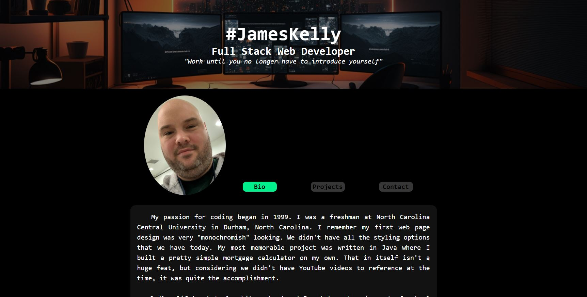
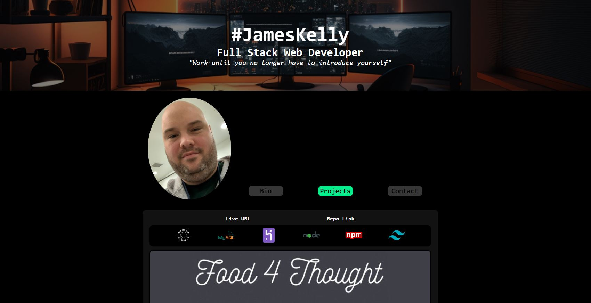
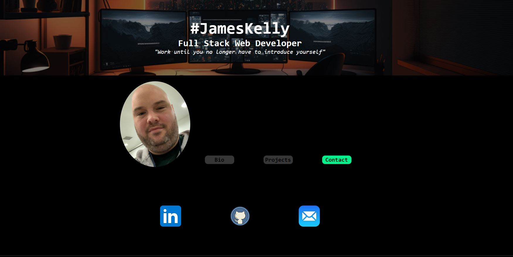

# **Who_is_James**
 

## **Description**
A never ending portfolio page of some of my work that will constantly be updated as I complete future projects. With convenient links you can access my email and check me out on various social media platforms. I want to make it easy for a recruiter or potential employer to be able to do research on me. This also gives me a chance to showcase my skills to these individuals.
 

## **Table of Contents**
- [**Usage**](#usage)
- [**Credits**](#credits)
- [**License**](#license)

## **Usage**
 
This page can be viewed here: <a href="https://jk377y.github.io/Who_is_James/">Live Link</a>
  

   

   

   

## **Credits**
**Sources that I use regularly for completion of my projects:**
 
FABIEN MORENO @ https://www.linkedin.com/in/fabien-moreno/
For collaboration, ideas and assistance.
 
STEFAN MISCHOOK @ https://www.youtube.com/c/StefanMischook for walkthroughs and explanation of JavaScript functions and tutoring.
 
WittCode @ https://www.youtube.com/@WittCode/videos for instructional videos on relavent topics.
 
MOSH HAMEDANI @ https://www.codewithmosh.com for instructional videos on relavent topics.
 
GHULAM ABBAS @ UDEMY https://www.udemy.com/course/build-restful-api-in-nodejs/ for Node.js - The Complete RESTful API Masterclass (2023)
 
W3C @ https://validator.w3.org/ for use of the markup validation service.
 
Unsplash @ https://unsplash.com/ for use of several images viewable on this project.
 
Mozilla MDN Web Docs @ https://developer.mozilla.org/en-US/ for use of documenation for technical reference.
 

## **License**

 Copyright (c) 2023 James Kelly
 Information on this license can be found at: (https://opensource.org/licenses/MIT)
