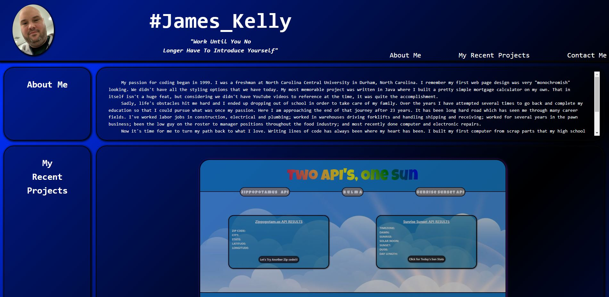

# **Who_is_James**
## **Description**
A never ending portfolio page of some of my work that will constantly be updated as I complete future projects. With convenient links you can access my email and check me out on various social media platforms. I want to make it easy for a recruiter or potential employer to be able to do research on me. This also gives me a chance to showcase my skills to these individuals.
## **Table of Contents**
- [**Installation**](#installation)
- [**Usage**](#usage)
- [**Credits**](#credits)
- [**License**](#license)
## **Installation**
No steps required for installation.
## **Usage**
This page can be viewed at ***https://jk377y.github.io/Who_is_James/***

## **Credits**
**Fabien Moreno** https://www.linkedin.com/in/fabien-moreno/ for collaboration and ideas during the creation of this project.

**W3C** https://validator.w3.org/ for use of the markup validation service.

**Unsplash** https://unsplash.com/ for use of several images viewable on this project.

**Mozilla MDN Web Docs** https://developer.mozilla.org/en-US/ for use of documenation for technical reference.
## **License**
MIT License

Copyright (c) 2022 James Kelly

Permission is hereby granted, free of charge, to any person obtaining a copy
of this software and associated documentation files (the "Software"), to deal
in the Software without restriction, including without limitation the rights
to use, copy, modify, merge, publish, distribute, sublicense, and/or sell
copies of the Software, and to permit persons to whom the Software is
furnished to do so, subject to the following conditions:

The above copyright notice and this permission notice shall be included in all
copies or substantial portions of the Software.

THE SOFTWARE IS PROVIDED "AS IS", WITHOUT WARRANTY OF ANY KIND, EXPRESS OR
IMPLIED, INCLUDING BUT NOT LIMITED TO THE WARRANTIES OF MERCHANTABILITY,
FITNESS FOR A PARTICULAR PURPOSE AND NONINFRINGEMENT. IN NO EVENT SHALL THE
AUTHORS OR COPYRIGHT HOLDERS BE LIABLE FOR ANY CLAIM, DAMAGES OR OTHER
LIABILITY, WHETHER IN AN ACTION OF CONTRACT, TORT OR OTHERWISE, ARISING FROM,
OUT OF OR IN CONNECTION WITH THE SOFTWARE OR THE USE OR OTHER DEALINGS IN THE
SOFTWARE.